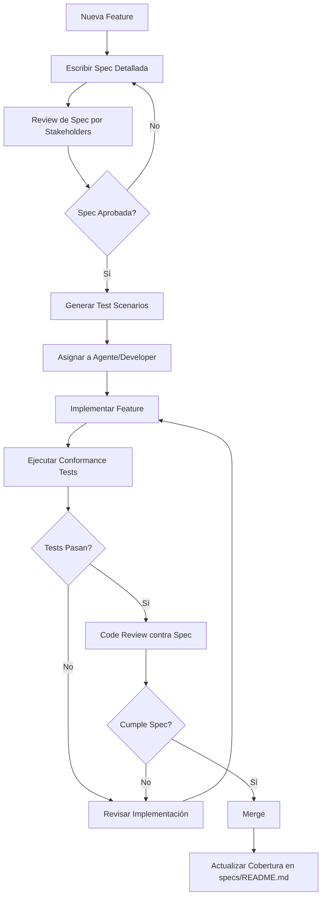

# Guía Completa: SRS y Spec-Driven Development

## Tabla de Contenidos
1. [Fundamentos del SRS (Software Requirements Specification)](#fundamentos-del-srs)
2. [Spec-Driven Development](#spec-driven-development)
3. [Estructura de Proyecto bajo Spec-Driven Development](#estructura-de-proyecto)
4. [Interacción con Agentes IA](#interacción-con-agentes-ia)

---

## Fundamentos del SRS (Software Requirements Specification)

### ¿Qué es un SRS?

El SRS es un documento que describe de manera exhaustiva el comportamiento esperado de un sistema software. Actúa como contrato entre stakeholders, desarrolladores y agentes automatizados.

### Principios Fundamentales de un Buen SRS

#### 1. **Claridad y No Ambigüedad**
- Cada requisito debe tener una única interpretación
- Usar lenguaje preciso, evitar términos vagos como "aproximadamente", "generalmente", "user-friendly"
- Definir términos técnicos en un glosario

#### 2. **Completitud**
- Cubrir todos los escenarios posibles (casos normales, edge cases, errores)
- Incluir requisitos funcionales y no funcionales
- Especificar qué NO hace el sistema (límites explícitos)

#### 3. **Consistencia**
- No debe haber contradicciones entre requisitos
- Usar terminología uniforme en todo el documento
- Mantener coherencia en el nivel de detalle

#### 4. **Verificabilidad**
- Cada requisito debe ser testeable
- Incluir criterios de aceptación medibles
- Especificar condiciones de éxito objetivas

#### 5. **Trazabilidad**
- Cada requisito debe tener un identificador único
- Mantener enlaces entre requisitos y features
- Facilitar el seguimiento de cambios

#### 6. **Priorización**
- Clasificar requisitos (críticos, importantes, deseables)
- Usar frameworks como MoSCoW (Must, Should, Could, Won't)

---

## Estructura de un SRS Inicial Efectivo

### 1. **Introducción**

```markdown
## 1. Introducción

### 1.1 Propósito
[Describir el propósito del documento y del sistema]

### 1.2 Alcance
[Definir qué está dentro y fuera del alcance]

### 1.3 Definiciones, Acrónimos y Abreviaturas
- API: Application Programming Interface
- JWT: JSON Web Token
[...]

### 1.4 Referencias
[Documentos, estándares o recursos relacionados]

### 1.5 Visión General
[Descripción de alto nivel del sistema]
```

### 2. **Descripción General**

```markdown
## 2. Descripción General

### 2.1 Perspectiva del Producto
[Cómo se relaciona con otros sistemas, APIs externas, etc.]

### 2.2 Funciones del Producto
[Resumen de las principales funcionalidades]

### 2.3 Características de Usuarios
[Perfiles de usuario, roles, permisos]

### 2.4 Restricciones
- Tecnológicas: [frameworks, lenguajes obligatorios]
- Regulatorias: [GDPR, HIPAA, etc.]
- De negocio: [presupuesto, tiempo]

### 2.5 Suposiciones y Dependencias
[Condiciones asumidas que afectan el desarrollo]
```

### 3. **Requisitos Específicos** (La Parte Más Crítica)

```markdown
## 3. Requisitos Funcionales

### RF-001: Autenticación de Usuario
**Prioridad:** MUST
**Descripción:** El sistema debe permitir a los usuarios autenticarse usando email y contraseña.

**Precondiciones:**
- El usuario debe estar registrado en el sistema
- La base de datos debe estar accesible

**Flujo Principal:**
1. Usuario ingresa email y contraseña
2. Sistema valida formato de email
3. Sistema verifica credenciales contra base de datos
4. Sistema genera JWT con expiración de 24 horas
5. Sistema retorna token al usuario

**Flujos Alternativos:**
- 3a. Si credenciales son inválidas: retornar error 401 con mensaje "Credenciales inválidas"
- 2a. Si formato de email es inválido: retornar error 400 con mensaje específico

**Postcondiciones:**
- Usuario autenticado posee token JWT válido
- Evento de login registrado en audit log

**Criterios de Aceptación:**
- [ ] Tasa de éxito de autenticación > 99.9% para credenciales válidas
- [ ] Tiempo de respuesta < 200ms (p95)
- [ ] Intentos fallidos bloqueados después de 5 intentos en 15 minutos

**Validaciones:**
- Email: formato RFC 5322
- Contraseña: mínimo 8 caracteres, al menos 1 mayúscula, 1 número, 1 símbolo

**Dependencias:**
- Base de datos PostgreSQL
- Librería bcrypt para hashing
- Librería jsonwebtoken para JWT
```

### 4. **Requisitos No Funcionales**

```markdown
## 4. Requisitos No Funcionales

### RNF-001: Performance
- **Latencia:** p95 < 500ms para todas las operaciones CRUD
- **Throughput:** Soportar 1000 requests/segundo
- **Escalabilidad:** Horizontal scaling hasta 10 instancias

### RNF-002: Seguridad
- Encriptación en tránsito: TLS 1.3+
- Encriptación en reposo: AES-256
- Gestión de secretos: AWS Secrets Manager / HashiCorp Vault
- Rate limiting: 100 req/min por IP

### RNF-003: Disponibilidad
- Uptime: 99.9% (SLA)
- RTO (Recovery Time Objective): 1 hora
- RPO (Recovery Point Objective): 15 minutos

### RNF-004: Mantenibilidad
- Cobertura de tests: > 80%
- Documentación de API: OpenAPI 3.0
- Logging estructurado: JSON con correlación IDs

### RNF-005: Usabilidad
- Interfaz responsive (mobile-first)
- Soportar navegadores: Chrome, Firefox, Safari (últimas 2 versiones)
- Accesibilidad: WCAG 2.1 Level AA
```

### 5. **Casos de Uso Detallados**

```markdown
## 5. Casos de Uso

### UC-001: Crear Nueva Tarea

**Actor Principal:** Usuario Autenticado
**Stakeholders:** Usuario, Sistema de Notificaciones
**Precondiciones:** Usuario autenticado con permisos de escritura

**Flujo Básico:**
1. Usuario solicita crear nueva tarea
2. Sistema presenta formulario
3. Usuario completa: título, descripción, fecha límite, prioridad
4. Usuario envía formulario
5. Sistema valida datos
6. Sistema genera UUID para la tarea
7. Sistema almacena tarea en BD
8. Sistema envía notificación asíncrona
9. Sistema retorna confirmación con ID de tarea

**Flujos Alternativos:**
5a. Validación falla:
   1. Sistema retorna errores específicos por campo
   2. Usuario corrige y reenvía
   
**Flujo de Excepción:**
7a. Fallo de base de datos:
   1. Sistema registra error en logs
   2. Sistema retorna 503 Service Unavailable
   3. Sistema reintenta hasta 3 veces con exponential backoff

**Postcondiciones:**
- Tarea almacenada en BD con estado "pending"
- Usuario notificado vía WebSocket
- Evento registrado en event log
```

### 6. **Modelos de Datos**

```markdown
## 6. Modelos de Datos

### Entity: User

```typescript
interface User {
  id: UUID;                    // Primary key
  email: string;               // Unique, indexed
  passwordHash: string;        // bcrypt hash
  firstName: string;
  lastName: string;
  role: 'admin' | 'user' | 'guest';
  createdAt: DateTime;
  updatedAt: DateTime;
  lastLoginAt: DateTime | null;
  isActive: boolean;           // Soft delete flag
}

// Constraints:
// - email: UNIQUE, NOT NULL, CHECK (email ~* '^[A-Za-z0-9._%+-]+@[A-Za-z0-9.-]+\.[A-Z|a-z]{2,}$')
// - passwordHash: NOT NULL
// - role: NOT NULL, DEFAULT 'user'
```

### Relaciones

```
User 1---* Task
User 1---* Session
Task *---* Tag (many-to-many)
```
```

### 7. **Interfaces Externas**

```markdown
## 7. Interfaces

### 7.1 API REST Endpoints

#### POST /api/v1/auth/login
**Descripción:** Autenticar usuario

**Request:**
```json
{
  "email": "user@example.com",
  "password": "SecurePass123!"
}
```

**Response 200:**
```json
{
  "token": "eyJhbGciOiJIUzI1NiIs...",
  "expiresIn": 86400,
  "user": {
    "id": "123e4567-e89b-12d3-a456-426614174000",
    "email": "user@example.com",
    "role": "user"
  }
}
```

**Response 401:**
```json
{
  "error": "INVALID_CREDENTIALS",
  "message": "Email or password incorrect"
}
```

**Rate Limit:** 5 requests/minute per IP
```

---

## Spec-Driven Development

### ¿Qué es Spec-Driven Development?

Spec-Driven Development (SDD) es una metodología donde **la especificación completa precede al código**, y el desarrollo se convierte en un proceso de implementación de specs verificables.

### Principios Fundamentales

#### 1. **Spec-First, Code-Second**
```
Proceso tradicional:
Idea → Código → Tests → Documentación

Spec-Driven:
Idea → Spec Detallada → Tests (generados de spec) → Código → Validación contra Spec
```

#### 2. **Single Source of Truth**
- La spec es la única fuente de verdad
- Código y tests derivan de la spec
- Documentación se genera de la spec

#### 3. **Verificación Continua**
- Cada commit verifica conformidad con spec
- Tests de conformidad automáticos
- Validación de contratos de API

#### 4. **Evolución Controlada**
- Cambios deben primero actualizar la spec
- Versionado semántico de specs
- Breaking changes claramente identificados

### Ventajas del SDD

#### Para Desarrollo Humano:
- Reduce ambigüedad antes de escribir código
- Facilita code reviews (comparar contra spec)
- Onboarding más rápido de nuevos desarrolladores

#### Para Agentes IA:
- **Instrucciones inequívocas:** Reduce alucinaciones
- **Validación automática:** Agentes pueden auto-verificar output
- **Trabajo paralelo:** Múltiples agentes trabajan sobre specs distintas sin conflictos
- **Regeneración confiable:** Mismo resultado en múltiples ejecuciones

### Diferencias con Otras Metodologías

| Aspecto | TDD | BDD | **SDD** |
|---------|-----|-----|---------|
| **Artefacto primario** | Tests | Comportamiento en lenguaje natural | Especificación formal |
| **Cuándo se escribe** | Antes del código | Antes del código | Antes de todo |
| **Granularidad** | Función/método | Feature | Sistema completo |
| **Audiencia** | Desarrolladores | Stakeholders + Devs | Todos + Agentes IA |
| **Verificabilidad** | Alta | Media | Muy alta |

---

## Estructura de Proyecto bajo Spec-Driven Development

### Estructura de Directorios

```
project-root/
├── specs/                          # 📋 FUENTE DE VERDAD
│   ├── README.md                   # Índice de especificaciones
│   ├── SRS.md                      # Software Requirements Specification principal
│   ├── architecture/
│   │   ├── system-design.md        # Arquitectura general
│   │   ├── data-models.md          # Esquemas de datos
│   │   └── api-contracts.md        # Contratos de API (OpenAPI)
│   ├── features/
│   │   ├── auth/
│   │   │   ├── spec.md             # Spec detallada de autenticación
│   │   │   ├── test-scenarios.md   # Escenarios de test
│   │   │   └── acceptance-criteria.md
│   │   ├── tasks/
│   │   │   └── spec.md
│   │   └── notifications/
│   │       └── spec.md
│   ├── non-functional/
│   │   ├── performance.md
│   │   ├── security.md
│   │   └── scalability.md
│   └── versions/
│       ├── v1.0.0/                 # Specs versionadas
│       └── v2.0.0/
│
├── src/                            # 💻 Implementación
│   ├── auth/
│   │   ├── auth.service.ts
│   │   ├── auth.controller.ts
│   │   └── auth.spec.ts            # Link: specs/features/auth/spec.md
│   ├── tasks/
│   └── shared/
│
├── tests/
│   ├── unit/
│   ├── integration/
│   ├── e2e/
│   └── conformance/                # Tests generados desde specs
│       ├── auth.conformance.test.ts
│       └── tasks.conformance.test.ts
│
├── docs/
│   ├── api/                        # Generado desde specs/architecture/api-contracts.md
│   ├── guides/
│   └── changelog/                  # Generado desde specs/versions/
│
├── .ai/                            # 🤖 Configuración para agentes
│   ├── agents.yml                  # Definición de agentes
│   ├── prompts/
│   │   ├── code-generator.md       # Prompt para agente generador
│   │   ├── test-generator.md
│   │   └── reviewer.md
│   └── workflows/
│       ├── feature-implementation.yml
│       └── spec-validation.yml
│
├── scripts/
│   ├── validate-spec.sh            # Valida coherencia de specs
│   ├── generate-tests.sh           # Genera tests desde specs
│   └── sync-docs.sh                # Sincroniza docs con specs
│
└── package.json / requirements.txt
```

### Archivos Clave

#### `specs/README.md` - Índice Maestro

```markdown
# Especificaciones del Proyecto

## Estado Actual
- **Versión de Spec:** v1.2.0
- **Última Actualización:** 2024-04-15
- **Cobertura de Implementación:** 73%

## Mapa de Especificaciones

### Core Specs
- [SRS Principal](./SRS.md) - Especificación de requisitos
- [Arquitectura del Sistema](./architecture/system-design.md)
- [Modelos de Datos](./architecture/data-models.md)

### Features
| Feature | Spec | Estado | Cobertura Tests | Asignado a |
|---------|------|--------|-----------------|------------|
| Autenticación | [spec](./features/auth/spec.md) | ✅ Implementado | 95% | Agent-Backend |
| Gestión Tareas | [spec](./features/tasks/spec.md) | 🚧 En progreso | 60% | Agent-Backend |
| Notificaciones | [spec](./features/notifications/spec.md) | 📋 Especificado | 0% | Agent-Workers |

## Reglas de Modificación
1. Todo cambio requiere PR en `/specs/` primero
2. Cambios breaking requieren bump de versión mayor
3. Tests de conformidad deben pasar antes de merge
```

#### `.ai/agents.yml` - Configuración de Agentes

```yaml
version: "1.0"

agents:
  - name: backend-agent
    role: backend-developer
    responsibilities:
      - Implementar endpoints según specs/architecture/api-contracts.md
      - Mantener cobertura > 80%
    constraints:
      - Nunca modificar specs/
      - Seguir convenciones de código en docs/style-guide.md
    context:
      - specs/features/auth/spec.md
      - specs/features/tasks/spec.md
      - specs/architecture/data-models.md
    
  - name: test-agent
    role: qa-engineer
    responsibilities:
      - Generar tests desde specs/features/*/test-scenarios.md
      - Ejecutar conformance tests
      - Reportar discrepancias entre código y spec
    constraints:
      - Solo leer código, nunca modificar
    outputs:
      - tests/conformance/
      - reports/conformance-report.md
  
  - name: reviewer-agent
    role: code-reviewer
    responsibilities:
      - Verificar conformidad con spec
      - Validar criterios de aceptación
      - Sugerir mejoras de performance
    context:
      - specs/non-functional/performance.md
      - specs/non-functional/security.md
```

### Workflow de Desarrollo



---

## Interacción con Agentes IA

### Principios para Trabajar con Agentes

#### 1. **Contexto Explícito, No Asumido**

❌ **Incorrecto:**
```
"Implementa la autenticación"
```

✅ **Correcto:**
```
Implementa el módulo de autenticación siguiendo:
- Spec: specs/features/auth/spec.md (requisito RF-001)
- Contratos API: specs/architecture/api-contracts.md (sección 3.1)
- Restricciones de seguridad: specs/non-functional/security.md (RNF-002)

Criterios de aceptación:
- [ ] Endpoint POST /api/v1/auth/login implementado
- [ ] JWT con expiración 24h
- [ ] Rate limiting 5 req/min
- [ ] Tests de conformidad en tests/conformance/auth.conformance.test.ts

Output esperado:
- src/auth/auth.service.ts
- src/auth/auth.controller.ts
- tests/unit/auth.service.test.ts
```

#### 2. **Verificación Incorporada**

Incluir en cada prompt mecanismos de auto-verificación:

```markdown
Después de generar el código:
1. Verifica que cada endpoint en api-contracts.md está implementado
2. Ejecuta: npm test -- auth.conformance.test.ts
3. Confirma cobertura > 80% con: npm run coverage
4. Lista cualquier discrepancia entre código y spec

Formato de respuesta:
## Implementación
[código]

## Verificación
- [x] Endpoints implementados: POST /login ✓
- [x] Tests de conformidad: PASS (12/12)
- [x] Cobertura: 87%
- [ ] Discrepancias: Ninguna
```

#### 3. **Granularidad Apropiada**

| Complejidad | Instrucción para Agente | Archivos de Contexto |
|-------------|-------------------------|----------------------|
| **Simple** | "Implementa endpoint GET /health" | api-contracts.md |
| **Media** | "Implementa CRUD completo para Tasks" | features/tasks/spec.md + data-models.md |
| **Alta** | "Implementa feature de notificaciones con workers" | Dividir en subtareas + múltiples agentes |

#### 4. **Iteración con Retroalimentación**

```
Paso 1 - Generación:
"Genera implementación de auth según spec.md"

Paso 2 - Revisión:
"Revisa el código generado contra estos criterios:
- Validación de email según RFC 5322 (spec sección 3.1.5)
- Logging de eventos de seguridad (non-functional/security.md RNF-002)
- Manejo de errores con códigos específicos (api-contracts.md)"

Paso 3 - Refinamiento:
"Ajusta implementación para corregir:
[lista de issues del paso 2]"
```

### Estrategias Multi-Agente

#### Escenario 1: Pipeline de Desarrollo

```yaml
workflow: feature-implementation

stages:
  - name: specification
    agent: spec-writer-agent
    input: stakeholder-requirements.md
    output: specs/features/new-feature/spec.md
    
  - name: test-generation
    agent: test-agent
    input: specs/features/new-feature/spec.md
    output: tests/conformance/new-feature.test.ts
    dependencies: [specification]
    
  - name: implementation
    agent: backend-agent
    input: 
      - specs/features/new-feature/spec.md
      - tests/conformance/new-feature.test.ts
    output: src/new-feature/
    dependencies: [test-generation]
    
  - name: review
    agent: reviewer-agent
    input:
      - src/new-feature/
      - specs/features/new-feature/spec.md
    output: review-report.md
    dependencies: [implementation]
    
  - name: validation
    agent: qa-agent
    input:
      - src/new-feature/
      - tests/conformance/new-feature.test.ts
    output: conformance-report.md
    dependencies: [implementation]
```

#### Escenario 2: Agentes Especializados Paralelos

```
Feature: Sistema de Notificaciones

├── Agent-API (Paralelo)
│   └── Implementa endpoints REST
│       Input: specs/features/notifications/api-spec.md
│
├── Agent-Workers (Paralelo)
│   └── Implementa workers de procesamiento
│       Input: specs/features/notifications/workers-spec.md
│
├── Agent-DB (Paralelo)
│   └── Crea esquemas y migraciones
│       Input: specs/architecture/data-models.md (sección Notifications)
│
└── Agent-Integration (Secuencial, después de los anteriores)
    └── Integra componentes y valida flujo completo
        Input: Outputs de Agent-API, Agent-Workers, Agent-DB
```

### Prompts Optimizados para Agentes

#### Template: Implementación de Feature

```markdown
# Tarea: Implementar [Feature Name]

## Contexto
Lee cuidadosamente:
1. {link a spec principal}
2. {link a modelos de datos}
3. {link a contratos API}

## Objetivo
Implementar la feature cumpliendo **todos** los criterios en {spec link, sección X}.

## Restricciones
- Tecnologías: {lista de stack tech}
- Patrones: {arquitectura, design patterns requeridos}
- No modificar: {archivos que no debe tocar}

## Output Esperado
```
src/
  ├── {feature}/
  │   ├── {feature}.service.ts
  │   ├── {feature}.controller.ts
  │   ├── {feature}.dto.ts
  │   └── {feature}.entity.ts
tests/
  └── unit/
      └── {feature}.service.test.ts
```

## Checklist de Entrega
Antes de presentar el código, verifica:
- [ ] Todos los requisitos funcionales de {spec} implementados
- [ ] Tests unitarios con cobertura > 80%
- [ ] Validaciones según {spec, sección validaciones}
- [ ] Manejo de errores según {api-contracts, sección errors}
- [ ] Logging de eventos críticos
- [ ] Conformidad con {non-functional/performance.md}

## Formato de Respuesta
### Archivos Generados
[lista de archivos con breve descripción]

### Implementación
[código]

### Tests Ejecutados
[output de tests]

### Verificación de Conformidad
[tabla comparando requisitos vs implementación]
```

#### Template: Code Review

```markdown
# Tarea: Revisar Implementación de [Feature]

## Código a Revisar
{path a archivos o diff}

## Spec de Referencia
{link a spec}

## Criterios de Revisión

### 1. Conformidad con Spec
Para cada requisito en {spec}:
- ¿Está implementado?
- ¿La implementación es correcta?
- ¿Hay edge cases sin cubrir?

### 2. Calidad de Código
- ¿Sigue principios SOLID?
- ¿Hay code smells?
- ¿Es mantenible?

### 3. Performance
Según {non-functional/performance.md}:
- ¿Cumple objetivos de latencia?
- ¿Hay N+1 queries?
- ¿Se usan índices apropiados?

### 4. Seguridad
Según {non-functional/security.md}:
- ¿Hay vulnerabilidades evidentes?
- ¿Se validan inputs correctamente?
- ¿Se manejan secretos apropiadamente?

## Formato de Respuesta
### Conformidad
| Requisito | Implementado | Correcto | Comentarios |
|-----------|--------------|----------|-------------|
| RF-001 | ✅ | ✅ | - |
| RF-002 | ✅ | ❌ | Falta validación de edge case X |

### Issues Encontrados
**Críticos:** [lista]
**Mayores:** [lista]
**Menores:** [lista]

### Sugerencias de Mejora
[lista priorizada]

### Decisión
[ ] APROBAR
[ ] APROBAR CON CAMBIOS MENORES
[ ] REQUIERE CAMBIOS MAYORES
```

### Mejores Prácticas

#### 1. **Versionado de Specs y Sincronización**

```bash
# scripts/validate-spec.sh
#!/bin/bash

# Verifica que código está sincronizado con spec actual

SPEC_VERSION=$(grep "Versión de Spec" specs/README.md | cut -d' ' -f4)
CODE_VERSION=$(grep "specVersion" package.json | cut -d'"' -f4)

if [ "$SPEC_VERSION" != "$CODE_VERSION" ]; then
  echo "❌ ERROR: Spec version ($SPEC_VERSION) != Code version ($CODE_VERSION)"
  echo "Actualiza código o spec antes de continuar"
  exit 1
fi

echo "✅ Versiones sincronizadas: $SPEC_VERSION"
```

#### 2. **Tests de Conformidad Automáticos**

```typescript
// tests/conformance/spec-validator.test.ts

import { validateAgainstSpec } from './spec-validator';
import authSpec from '../../specs/features/auth/spec.md';

describe('Auth Module Conformance', () => {
  it('should implement all required endpoints from spec', () => {
    const specEndpoints = parseEndpoints(authSpec);
    const implementedEndpoints = getImplementedEndpoints();
    
    expect(implementedEndpoints).toContainAll(specEndpoints);
  });
  
  it('should validate inputs as specified', async () => {
    const specValidations = parseValidations(authSpec);
    
    for (const validation of specValidations) {
      const result = await testValidation(validation);
      expect(result).toBe('conformant');
    }
  });
});
```

#### 3. **Documentación Auto-Generada**

```bash
# scripts/sync-docs.sh

# Genera OpenAPI desde specs/architecture/api-contracts.md
npx @openapitools/openapi-generator-cli generate \
  -i specs/architecture/api-contracts.md \
  -g html2 \
  -o docs/api/

# Genera changelog desde specs/versions/
node scripts/generate-changelog.js
```

#### 4. **Flujo de Trabajo con Agentes**

```bash
# Paso 1: Nueva feature request
./scripts/create-feature-spec.sh "User Profile Management"
# Genera: specs/features/user-profile/spec.md (template)

# Paso 2: Humano completa spec
# Edita: specs/features/user-profile/spec.md

# Paso 3: Genera tests desde spec
./scripts/generate-tests.sh specs/features/user-profile/spec.md
# Genera: tests/conformance/user-profile.conformance.test.ts

# Paso 4: Asigna a agente
cat <<EOF | ai-agent backend-agent
Implementa feature según specs/features/user-profile/spec.md
Asegura que tests/conformance/user-profile.conformance.test.ts pasen.
EOF

# Paso 5: Valida resultado
npm test -- user-profile.conformance.test.ts
./scripts/validate-spec.sh
```

---

## Checklist Final para SRS Inicial

### Antes de Empezar el Desarrollo

- [ ] **Completitud:** ¿Todos los requisitos identificados están documentados?
- [ ] **Claridad:** ¿Cada requisito tiene una única interpretación?
- [ ] **Verificabilidad:** ¿Cada requisito tiene criterios de aceptación medibles?
- [ ] **Trazabilidad:** ¿Cada requisito tiene ID único y está linkado a features?
- [ ] **Priorización:** ¿Requisitos clasificados con MoSCoW o similar?
- [ ] **No Funcionales:** ¿Performance, seguridad, escalabilidad especificados?
- [ ] **APIs:** ¿Contratos de API documentados (request/response/errors)?
- [ ] **Datos:** ¿Modelos de datos con constraints y relaciones?
- [ ] **Edge Cases:** ¿Flujos alternativos y de excepción cubiertos?
- [ ] **Validaciones:** ¿Reglas de validación explícitas por campo?

### Para Spec-Driven Development

- [ ] **Estructura:** ¿Directorio `/specs/` con SRS + features + arquitectura?
- [ ] **Versionado:** ¿Sistema de versionado semántico para specs?
- [ ] **Tests Generables:** ¿Specs escritas de manera que permitan generar tests?
- [ ] **Agente-Friendly:** ¿Specs sin ambigüedad para consumo por IA?
- [ ] **Sincronización:** ¿Scripts para validar código vs spec?

### Para Trabajo con Agentes

- [ ] **Configuración:** ¿Archivo `.ai/agents.yml` definiendo roles?
- [ ] **Contexto:** ¿Cada agente tiene links a specs relevantes?
- [ ] **Restricciones:** ¿Límites claros de qué pueden/no pueden modificar?
- [ ] **Verificación:** ¿Agentes tienen checklist de auto-verificación?
- [ ] **Feedback Loop:** ¿Proceso para iteración humano-agente definido?

---

## Recursos y Herramientas

### Herramientas para Gestión de Specs

- **OpenAPI / Swagger:** Para contratos de API
- **JSON Schema:** Para modelos de datos
- **Mermaid:** Para diagramas en Markdown
- **Vale:** Linting de documentación técnica
- **Spectral:** Validación de especificaciones OpenAPI

### Templates

```bash
# Generar template de spec
curl https://raw.githubusercontent.com/example/spec-templates/main/feature-spec.md \
  -o specs/features/new-feature/spec.md
```

### Flujo Git Recomendado

```bash
main
├── specs/*          # Solo specs estables, mergeadas
└── develop
    ├── spec/feature-x    # Branch para nueva spec
    └── impl/feature-x    # Branch para implementación (después de merge de spec)
```

---

## Conclusión

**Spec-Driven Development** transforma el desarrollo de software en un proceso de **implementación verificable** en lugar de exploración ambigua. 

**Claves del éxito:**
1. Invertir tiempo en specs de calidad antes de codificar
2. Mantener specs como fuente única de verdad
3. Automatizar validación de conformidad
4. Proporcionar contexto explícito a agentes IA
5. Iterar sobre specs, no sobre código ad-hoc

**Para agentes IA**, esto significa:
- Instrucciones inequívocas
- Output verificable automáticamente
- Trabajo paralelo sin conflictos
- Resultados reproducibles

El SRS inicial de calidad es la **inversión más importante** en un proyecto. Un día invertido en especificación ahorra semanas de refactoring y bugs.